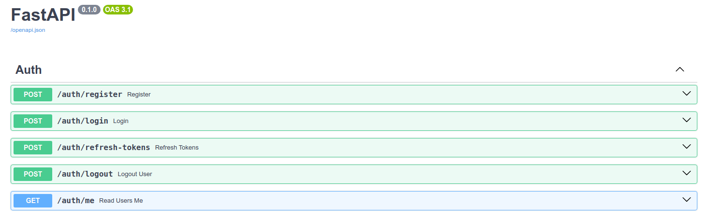

# fastapi-jwt-auth

JWT authorization using FastAPI.

## Content

1. [Example `.env` file](#example-env-file)
2. [Installation with containerization](#installation-with-containerization)
3. [Installation without containerization](#installation-without-containerization)
4. [Docs screenshot](#docs)


## Example .env file

Create a .env file in the root directory of your project with the following content:

```bash
DB_USER=postgres
DB_PASS=postgres
DB_HOST=db
DB_PORT=5432
DB_NAME=postgres

SECRET_KEY=YourSecretKeyHere
ALGORITHM=HS256
```

## Installation with containerization

```bash
sudo docker compose up --build -d
```

## Installation without containerization

```bash
pip install -r requirements.txt
alembic upgrade head
uvicorn main:app --reload
```

## Docs

